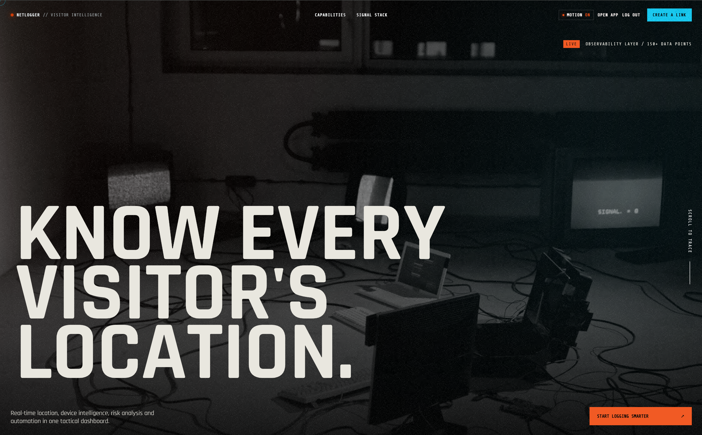
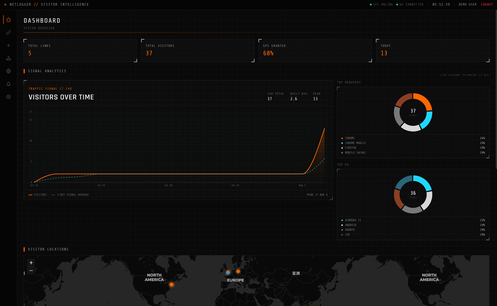
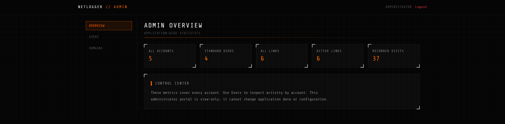

# NetLogger

**NetLogger is a consent-first visitor-intelligence workspace for the links you own and share.** It brings tracking links, live activity, custom domains, and dashboards into one focused interface.

**Try it:** [netlogger.omartaheri.com](https://netlogger.omartaheri.com)



## The small idea behind a bigger project

I originally built NetLogger for a light-hearted surprise: I wanted to know where a friend was so I could plan the surprise. It was a small personal experiment that grew into a full product, and people are still surprised that I built all of this for one moment like that.

That story is also the reason this project puts consent front and centre. Location and device information are personal. A clever technical project is never a reason to ignore someone else's privacy.

## Please use it ethically

Only use NetLogger with people who have clearly agreed to the collection and use of their information. Do not use it to secretly track, profile, pressure, manipulate, or locate anyone. Make the purpose clear, provide meaningful notice, collect only what is needed, and respect requests to stop.

Using tools like this without informed consent is unethical and may also be illegal where you live. This project is for transparent, legitimate use—not surveillance.

## What it includes

- Shareable tracking links with visitor activity and signal summaries
- A live user dashboard for links, visits, analytics, and locations
- A read-only administrator workspace for application-wide accounts, links, visits, and domains
- Custom domains with DNS verification before they can be activated
- Custom link slugs that are unique within each selected domain
- A guided Google sign-in onboarding flow so each account has a display name from the start
- Several tracking-page templates with previews that match the real rendered pages
- Real-time updates through WebSockets
- Optional resettable demo data for safe product demonstrations

## Product views

### User dashboard



### Administrator dashboard



## Run locally

You will need Node.js 18+, npm 9+, and Docker Desktop for PostgreSQL.

```bash
npm install
cp .env.example .env
docker compose up -d postgres
npm run dev
```

The web app runs at `http://localhost:5173`. Configure the API address through `BASE_URL` and `PORT` in `.env`.

For a production build:

```bash
npm run build
npm start
```

## Configuration highlights

| Setting | Purpose |
|---|---|
| `BASE_URL` | The public application URL used when generating links |
| `GOOGLE_CLIENT_ID` | Enables Google sign-in |
| `DOMAIN_CNAME_TARGET` | CNAME destination shown during custom-domain verification |
| `SEED_DEMO_DATA` | Set to `true` to reset and load demo content when the application starts |
| `SESSION_SECRET` | Secret used to protect application sessions |

Keep demo data disabled in public deployments unless you specifically need it. Never expose development credentials or secrets in a production environment.

## Useful commands

| Command | Purpose |
|---|---|
| `npm run dev` | Start the API and Vite development servers |
| `npm run build` | Build the web app, API, and tracking collector |
| `npm test` | Run API tests |
| `npm run test:web` | Run web tests |
| `npm run db:generate` | Generate a database migration |
| `npm run db:migrate` | Apply database migrations |
| `npm start` | Run the production build |

## Built with

React, TypeScript, Vite, Express, PostgreSQL, Drizzle ORM, and WebSockets.

---

If you build on NetLogger, keep the human side of visitor intelligence in view: transparency, consent, and respect are features too.
